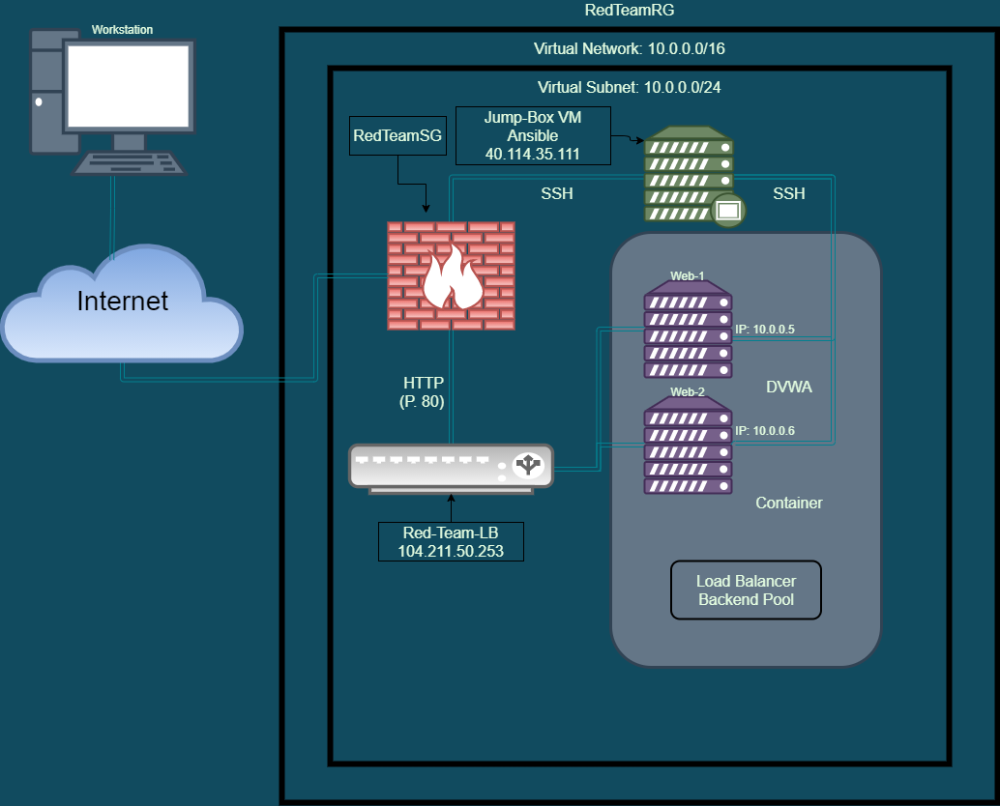
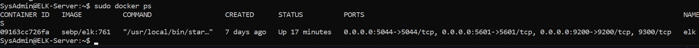

## Automated ELK Stack Deployment

The files in this repository were used to configure the network depicted below.

These files have been tested and used to generate a live ELK deployment on Azure. They can be used to either recreate the entire deployment pictured above. Alternatively, select portions of the [install-elk.yml] (add_link) and [filebeat-playbook.yml] (add_link) file may be used to install only certain pieces of it, such as Filebeat.

This document contains the following details:
- Description of the Topology
- Access Policies
- ELK Configuration
  - Beats in Use
  - Machines Being Monitored
- How to Use the Ansible Build

### Description of the Topology

The main purpose of this network is to expose a load-balanced and monitored instance of DVWA, the D*mn Vulnerable Web Application.

Load balancing ensures that the application will be highly **Available**, in addition to restricting **access** to the network.

- A Load Balancer has an important security role while computing in the cloud. The load balancer will help protect against denial-of-service (DDoS) attacks by shifting the traffic from the/a corporate server to the/a public cloud provider being used.

- A Jump Box, also a Jump Server, is the host that is connected to from outside of the network. Once connected to this host it is then possible to connect to the other internal servers.

Integrating an ELK server allows users to easily monitor the vulnerable VMs for changes to the **logs** and system **traffic**.

- Filebeat is installed as an agent for the designated servers. It will monitor the log files or locations that are specified,collect log events, and will forward them either to Elasticsearch or Logstash for indexing. At the basics, filebeat is a shipper used in forwarding and centralizing log data. 

The configuration details of each machine may be found below.

| Name      | Function           | IP Address | Operating system |
|-----------|--------------------|------------|------------------|
| Jump Box  | Jump Box           | 10.0.0.4   | Linux            |
| Web-1     | DVWA Web Server    | 10.0.0.5   | Linux            |
| Web-2     | DVWA Web Server    | 10.0.0.6   | Linux            |
| ELK-Sever | Logging/Monitoring | 10.1.0.4   | Linux            |

### Access Policies

The machines on the internal network are not exposed to the public Internet. 

Only the **Jump Box** machine can accept connections from the Internet. Access to this machine is only allowed from the following IP addresses:
- _TODO: Add whitelisted IP addresses_

Machines within the network can only be accessed by **Jump Box**.
- _TODO: Which machine did you allow to access your ELK VM? What was its IP address?_

A summary of the access policies in place can be found in the table below.

| Name       | Publicly Accessible | Allowed IP Addresses |
|------------|---------------------|----------------------|
| Jump Box   | Yes                 | 136.49.44.116        |
| Web-1      | No                  | 10.0.0.4             |
| Web-2      | No                  | 10.0.0.4             |
| ELK-Server | No                  | 10.1.0.4             |

### Elk Configuration

Ansible was used to automate configuration of the ELK machine. No configuration was performed manually, which is advantageous because using Ansible for provisioning, configuration management, and application deployment in an Infrastructure as Code (IAC) scenario accomplishes the following:
 - Automated Configuration
 - Configuration Management
 - It is Agentless

The playbook implements the following tasks:
- Increase the memory.
- Install docker.io
- Install python3.pip
- Install docker, this is the Docker Python pip module.

The following screenshot displays the result of running `docker ps` after successfully configuring the ELK instance.

We have installed the following Beats on these machines:
- Filebeat

These Beats allow us to collect the following information from each machine:
- Filebeat monitors nd logs the data that it has been allowed and then transfers that data to Elasticsearch for review and retention.

### Using the Playbook
In order to use the playbook, you will need to have an Ansible control node already configured. Assuming you have such a control node provisioned: 

SSH into the control node and follow the steps below:
- Copy the filebeat-config.yml file to etc/ansible/files.
- Update the file to include the host IP for the Elk-sever (10.1.0.4) to port 9200 which is the API over HTTP that communicates with Elasticsearch
- Run the playbook, and navigate to ELK-Server to check that the installation worked as expected. (Complete this by using SSH to access the Private IP 10.1.0.4 of the ELK Server)

- The Playbook is the filebeat-playbook.yml that is in the etc/ansible/files
- Update the etc/ansible/filebeat-config.yml file to have Ansible run on a specific machine.
-The URL to navigate to is http://[vm.ip.address]:5601/app/kibana
  - **NOTE:** The IP Address used will be different based on the public IP Address assigned Azure. 

Run the following comands and complete the following actions in order to run, download the playbook, update the files, etc.:
- ssh RedAdmin@40.114.35.111
  - **NOTE:** The account name is what you made it; use your account name.
- sudo docker container list -a 
  - **NOTE:** This shows the name of your container(s).
- sudo docker start cool_sanderson *(This will start up the docker to be used.)*
  - **NOTE:** cool_sanderson is the name of my docker; use your docker name.
- sudo docker attach cool_sanderson *(This moves you into the named docker.)*
- Copy the SSH key from the Ansible container to past into the Jump Box **cat ~/.ssh/id_rsa.pub**
- Added this public key to be used as a login option on the Azure VM. 
- Open Ansible hosts file and add the new VM to the hosts file using the python3-pip service 
  - In my case I would type: **10.1.0.4 ansible_pythong_interpreter=/usr/bin/python3** *(Use your own VM Private IP Addess.)*
- SSH from Ansible container to ELK VM to check the connection before running the playbook.
- ansible-playbook elk.yml *(This runs the playbook.)
- If container is running then run: sudo docker ps *(This will show your docker container created.)*

If everything has worked correctly you will be able to go to the URL and see a web page for Kibana *(webpage URL is mentioned on line 100)*